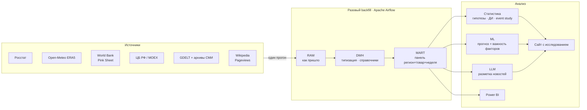

# 🌾 Agro Price ETL & Analytics

> **Статус: в разработке.** Репозиторий отражает архитектуру и текущий прогресс.
> Актуальное состояние — в разделе [Статус проекта](#статус-проекта).


---

## О проекте

Исследование факторов, которые двигают цены на продовольствие в России:
погода, мировые цены, курс рубля и новостной фон.

Ключевое отличие от типового ETL-проекта — **разовый сбор данных за исторический
период (backfill)**, а не постоянное обновление. DAG'и запускаются один раз,
наливают в PostgreSQL данные за 2015–2026 годы, после чего вся работа идёт
уже с этими данными в базе. Никаких расписаний и ежедневных апдейтов:
цель — не мониторинг, а анализ.

Главный вопрос проекта — не «как менялись цены», а **что и с каким лагом
на них влияет**, и совпадает ли то, что писали в новостях, с тем, что
произошло на самом деле.

---

## Гипотезы

Проект строится вокруг четырёх проверяемых утверждений.

| # | Гипотеза | Метод проверки |
|---|----------|----------------|
| 1 | Засуха в регионе-производителе поднимает закупочную цену с лагом 3–6 месяцев, а на импортозависимые товары не влияет | difference-in-differences: регионы с дефицитом осадков против остальных |
| 2 | Введение экспортной пошлины на зерно снизило внутреннюю цену относительно мировой | interrupted time series на спреде РФ/мир |
| 3 | Передача мировых цен во внутренние асимметрична: рост доходит быстрее, чем падение («rockets and feathers») | асимметричная модель коррекции ошибками |
| 4 | Новостная паника опережала ценовой скачок, а не следовала за ним (кейсы: гречка 2020, сахар 2021) | тест Грейнджера, кросс-корреляция |

### Отдельно: новости против факта

Разовый сбор новостного корпуса за тот же период позволяет сопоставить
заявления («цена вырастет из-за таких-то причин») с тем, что показали
исторические данные. Считается не тональность как таковая, а **сбываемость
прогнозов**: сколько заявленных в прессе движений цен действительно произошло.

---

## Методологическое замечание

Росстат измеряет **потребительские** цены в рознице, а розницу держат
федеральные сети с централизованным прайсингом. Локальная засуха может
не отразиться в цене на полке магазина в том же регионе — сеть выравнивает
цены по макрорегиону.

Поэтому анализ разделён на три уровня, а не сведён к одному переходу:

```
погода ──► цена производителя ──► оптовая цена ──► розничная цена
```

Затухание сигнала между уровнями — самостоятельный результат исследования,
а не помеха.

---

## Архитектура



**Принцип слоёв:** в `raw` попадает всё как есть, без фильтрации — чтобы при
смене решения (например, белого списка новостных доменов) не перекачивать
данные заново. Вся очистка живёт в `dwh`, вся агрегация — в `mart`.

**Идемпотентность.** DAG'и запускаются без расписания, но перезапускаться будут
многократно во время отладки. Загрузка везде через `INSERT ... ON CONFLICT
DO UPDATE` по естественному ключу, а не `TRUNCATE + INSERT`.

---

## Источники данных

Период: **2015-01-01 — 2026-06-30**. Статус проверки — по результатам
скриптов из `checks/`.

| Источник | Что даёт | Гранулярность | Доступ |
|----------|----------|---------------|--------|
| Росстат | потребительские цены по регионам | неделя / месяц × регион × товар | xlsx |
| Росстат / ЕМИСС | цены производителей с/х продукции | месяц × регион | выгрузка |
| Open-Meteo Archive (ERA5) | температура, осадки, влага почвы, ET₀ | сутки × координата | API без ключа |
| World Bank Pink Sheet | мировые цены: зерно, сахар, масла, удобрения | месяц | xlsx |
| Yahoo Finance | фьючерсы ZW, ZC, SB, Brent | день | API |
| MOEX ISS | торговый курс USD/RUB, индексы | день | API без ключа |
| ЦБ РФ | официальные курсы, ключевая ставка | день / событие | XML |
| GDELT Doc API | новостной фон, тональность, домены | статья | API без ключа |
| Wikipedia Pageviews | просмотры статей — прокси паники | сутки | API без ключа |
| Справочник событий | пошлины, квоты, эмбарго, решения ЦБ | событие | заполняется вручную |

Справочник событий (`data/events.csv`) по важности сопоставим с любым API:
на нём держатся гипотезы 2 и 4. Каждая дата проверяется по первоисточнику —
сдвиг события на две недели меняет результат interrupted time series.

### Производные признаки погоды

Сырая температура сама по себе ничего не объясняет. В `dwh` считаются:

- сумма активных температур выше 10 °C по фазам вегетации
- индекс осадков SPI за 1 / 3 / 6 месяцев
- число заморозков в мае, число дней выше 30 °C в июле
- дефицит влаги: `precipitation_sum − et0_fao_evapotranspiration`

---

## Стек

| Слой | Инструменты |
|------|-------------|
| Язык | Python 3.11 |
| Оркестрация | Apache Airflow (Docker Compose) |
| Хранилище | PostgreSQL (raw / dwh / mart) |
| Обработка | pandas, SQL |
| Статистика | statsmodels, scipy |
| ML | scikit-learn, градиентный бустинг, SHAP |
| NLP / LLM | разметка новостных текстов, сравнение с TF-IDF + логрег |
| BI | Power BI |
| Инфраструктура | Docker, VPS Ubuntu |

---

## Структура репозитория

```
agro-price-etl-analytics/
├── checks/            # разовые скрипты проверки доступности источников
├── exploration/       # ноутбуки-черновики, разведка API
│   └── open_meteo.ipynb
├── dags/              # Airflow DAG'и (schedule=None, запуск вручную)
├── etl/
│   ├── extract/       # клиенты источников
│   ├── transform/     # очистка, справочники, производные признаки
│   └── load/          # загрузка в PostgreSQL
├── sql/               # DDL слоёв raw / dwh / mart
├── analysis/          # проверка гипотез, доверительные интервалы, event study
├── ml/                # модели прогноза, feature importance
├── nlp/               # разметка новостей, LLM и классический бейзлайн
├── data/
│   └── events.csv     # справочник событий (заполняется вручную)
├── docker/            # docker-compose, конфигурация Airflow и PostgreSQL
└── site/              # сайт с изложением исследования
```

---

## Статус проекта

Легенда: ✅ готово · 🚧 в работе · 📋 запланировано

| # | Этап | Статус |
|---|------|--------|
| 1 | Проверка доступности источников (`checks/`) | 🚧 |
| 2 | Разведка Open-Meteo, первые запросы | 🚧 |
| 3 | Docker: Airflow + PostgreSQL на VPS | 📋 |
| 4 | Схема БД: слои raw / dwh / mart | 📋 |
| 5 | Справочники регионов и товаров | 📋 |
| 6 | Справочник событий | 📋 |
| 7 | DAG'и сбора: погода, мировые цены, курс | 📋 |
| 8 | DAG сбора: Росстат | 📋 |
| 9 | DAG сбора: новостной корпус (GDELT) | 📋 |
| 10 | Слой DWH: очистка, приведение регионов | 📋 |
| 11 | Слой MART: аналитическая панель | 📋 |
| 12 | Описательная статистика, доверительные интервалы | 📋 |
| 13 | Проверка гипотез: DiD, ITS, event study | 📋 |
| 14 | ML: прогноз цен, важность факторов | 📋 |
| 15 | LLM: разметка новостей, сбываемость прогнозов | 📋 |
| 16 | Power BI дашборды | 📋 |
| 17 | Сайт с изложением исследования | 📋 |

---

## Запуск

Раздел будет дополнен по мере готовности инфраструктуры.

```bash
# проверка доступности источников
cd checks
pip install requests pandas openpyxl
python 03_openmeteo_archive.py

# инфраструктура (планируется)
docker compose up -d
# Airflow UI: http://<host>:8080
```

---

## Ограничения

Честный список того, что проект **не** может показать:

- Данные наблюдательные, рандомизации нет — настоящего A/B-теста здесь
  не будет. Используются квазиэкспериментальные методы (DiD, ITS, event study),
  а выводы формулируются как связи, а не как доказанные причины.
- Глубина новостного корпуса ограничена 2015 годом (покрытие GDELT), тогда как
  цены и погода доступны с 1990-х. Разные горизонты источников оговариваются
  в каждом выводе отдельно.
- События 2020 и 2022 годов накладываются на многое одновременно; эффекты
  отдельных мер в эти периоды разделяются плохо, и там, где не разделяются,
  об этом сказано прямо.
- Временные ряды автокоррелированы: наивные t-тесты дают заниженные p-value.
  Значимость проверяется с поправками либо перестановочными тестами.
