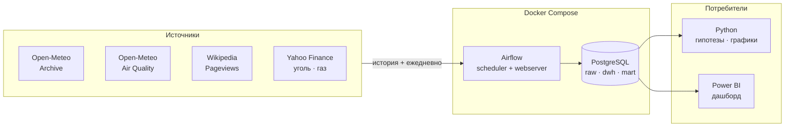

# 🌫️ Air Quality ETL & Analytics

Учебный, но настоящий data-проект: сбор данных о качестве воздуха, погоде,
общественном внимании и ценах на топливо, хранение в PostgreSQL и проверка
гипотезы о том, что двигает зимний смог в европейских городах.


---

## О проекте

Главный город исследования — **Краков**. Зимой он регулярно входит в список
самых грязных городов мира: котловина, печное отопление, температурная
инверсия. Максимум за всю доступную историю — **271 мкг/м³ PM2.5**
20 января 2025 года в 22:00.

Вопрос проекта: **чем объясняется зимний смог — погодой, поведением людей
или ценой топлива?**

Погода определяет, рассеется загрязнение или запрётся у земли. Цена угля
определяет, чем люди топят. Просмотры Википедии показывают, замечают ли
жители проблему. Четыре источника дают четыре независимых угла на одно
явление.

Проект небольшой намеренно — четыре источника, шесть городов. Цель: пройти
весь цикл целиком (сбор → хранение → трансформация → анализ → дашборд),
а не утонуть в парсинге на первом шаге.

---

## Источники данных

| Источник | Что даёт | Шаг | Глубина | Формат |
|----------|----------|-----|---------|--------|
| **Open-Meteo Archive** | температура, ветер, осадки, давление | сутки | с 1940 | JSON |
| **Open-Meteo Air Quality** | PM2.5, PM10, NO₂, SO₂, озон, EAQI | час → сводим к суткам | с 2013 (Европа) | JSON |
| **Wikipedia Pageviews** | просмотры статей о смоге и загрязнении | сутки | с 07.2015 | JSON |
| **Yahoo Finance** | цена угля `MTF=F`, газа `TTF=F` | день | с 2013 / с 10.2017 | JSON |

Все четыре — без ключей и без регистрации.

### Что проверено на практике

**Воздух.** У API нет параметра `daily` — только почасовые значения.
Суточные агрегаты считаем сами, это первая трансформация проекта.
Реанализ CAMS покрывает Европу с 2013 года; восточнее Урала работает
глобальная модель с архивом примерно с августа 2022. При запросе за пределами
покрытия API отвечает `HTTP 200` и отдаёт **массив из одних `null`** —
без ошибки. Проверка на пустые значения обязательна везде.

**Объём.** 13.5 лет почасовых данных по одному городу — 119 064 значения,
и всё это отдаётся **одним запросом** за несколько секунд. Пропусков
в краковском ряду всего два (1 января 2013, первые два часа).

**Цены.** `MTF=F` (уголь ARA, Роттердам) — 4 121 торговый день начиная
с 04.01.2013, диапазон от 38.6 до 438.4 долларов за тонну. Начало ряда
совпадает с началом данных о воздухе, подрезать период не нужно.
`TTF=F` (газ, Нидерланды) — с октября 2017, размах от 3.5 до 339.2.
Время в ответе Yahoo приходит в Unix-формате, не в ISO.

**Внимание.** У Pageviews параметры зашиты в путь, а не в query-строку,
а данные приходят списком словарей, а не колонками — структура ответа
принципиально отличается от Open-Meteo.

---

## Города и дизайн исследования

Цена угля — **одна общая временная серия для всех городов**. Значит города
образуют панель, и проверять можно не просто «связь есть», а **где именно
она есть**.

Отношение зима/лето по PM2.5 показывает, какая доля загрязнения приходится
на отопительный сезон (данные за 2024 год):

| Город | Зима | Лето | Зима/лето | Топливо | Роль |
|-------|-----:|-----:|----------:|---------|------|
| Катовице | 35.3 | 12.2 | 2.90 | уголь | обработка |
| **Краков** | 37.2 | 11.4 | 3.26 | уголь | обработка |
| Сараево | 31.9 | 10.2 | 3.12 | уголь | обработка |
| Милан | 55.3 | 10.9 | 5.06 | дрова, биомасса | промежуточная |
| Париж | 14.3 | 8.5 | 1.68 | газ | **контроль** |
| Москва | 28.6 | 20.9 | 1.37 | центральные ТЭЦ | **контроль** |

Логика проста: если цена угля действительно влияет на воздух, эффект должен
быть сильным в Кракове и Катовице, слабее в Милане и **нулевым в Париже
и Москве**. Контрольные города работают как плацебо-тест — если «влияние»
обнаружится и там, значит модель поймала общий тренд или сезонность,
а не механизм.

Для справки, полный рейтинг по отопительному следу за 2024 год возглавляют
Турин (5.42) и Милан (5.06), замыкают Лондон (1.23) и Афины (1.21).

---

## Гипотезы

| # | Гипотеза | Метод |
|---|----------|-------|
| 1 | Ветер разгоняет PM2.5, связь обратная и сильная | корреляция, регрессия |
| 2 | Мороз плюс штиль дают накопление (инверсия) | взаимодействие факторов |
| 3 | Дождь вымывает частицы, PM10 сильнее, чем PM2.5 | сравнение коэффициентов |
| 4 | Зимние пики приходятся на вечер — это растопка печей | суточный профиль по часам |
| 5 | Озон ведёт себя **наоборот**: растёт в жару и на солнце | корреляция с температурой |
| 6 | Рост цены угля снижает загрязнение в угольных городах | панельная регрессия с лагом |
| 7 | В газовых городах связи с ценой угля нет | **плацебо-тест** |
| 8 | Внимание людей отстаёт от эпизода на 1–2 дня | тест Грейнджера, кросс-корреляция |

### Что уже видно в данных

Топ-10 худших часов Кракова за 13 лет: **все десять в январе, все между
20:00 и 01:00**. Это получено простой сортировкой, без единой модели —
вечерняя растопка печей в мороз видна невооружённым глазом.

Найденные пики подтверждаются новостями независимо:

- **20.01.2025** — второй уровень угрозы загрязнением, средняя PM10
  по станциям 130 мкг/м³, предупреждение ГИОŚ.
- **19–20.01.2026** — третий, максимальный уровень: PM10 225, PM2.5 161,
  оповещения населения, бесплатный общественный транспорт. По версии IQAir
  Краков в тот день был третьим самым грязным городом мира.

То есть источник данных находит реальные кризисные эпизоды сам, по одним
только физическим полям.

---

## Архитектура



**Историю берём сразу, дальше растим ежедневно.** Все источники отдают
прошлое, поэтому анализ можно делать с первого дня. Ежедневный запуск
просто продолжает ряд.

**Идемпотентность.** Ежедневный DAG будет запускаться повторно и на
пересечении дат. Загрузка через `INSERT ... ON CONFLICT DO UPDATE`
по естественному ключу, а не `TRUNCATE + INSERT`.

**Задержка данных.** Архивный API отдаёт погоду с лагом в несколько дней,
поэтому ежедневный сбор идёт через forecast-эндпоинт с параметром
`past_days`, а архив используется для разовой заливки истории.

---

## Docker

Вся инфраструктура живёт в контейнерах — на машине не появляется ни Postgres,
ни Airflow, ни их зависимостей.

```bash
cd docker
cp .env.example .env        # логины, пароли, список городов
docker compose up -d
docker compose ps
```

### Сервисы

| Сервис | Образ | Порт | Назначение |
|--------|-------|------|------------|
| `postgres` | `postgres:16` | `5432` | хранилище данных проекта |
| `airflow-init` | `apache/airflow:2.9` | — | разовая инициализация БД и админа |
| `airflow-scheduler` | `apache/airflow:2.9` | — | запуск DAG'ов |
| `airflow-webserver` | `apache/airflow:2.9` | `8080` | веб-интерфейс |

### Тома

| Монтирование | Зачем |
|---|---|
| `pgdata:/var/lib/postgresql/data` | данные переживают пересоздание контейнера |
| `./dags:/opt/airflow/dags` | DAG'и правятся на хосте, подхватываются на лету |
| `./sql:/opt/airflow/sql` | DDL доступен из тасков |
| `./logs:/opt/airflow/logs` | логи видны с хоста |

### Важные детали

- **Две разные базы.** Airflow держит метаданные отдельно от данных проекта.
  Смешивать в одной схеме нельзя — снесёшь метаданные вместе с данными.
- **Пароли не в репозитории.** Секреты в `.env`, он в `.gitignore`.
  В репозитории только `.env.example` с пустыми полями.
- **Адрес базы разный.** Изнутри контейнера — `host=postgres`, из Power BI
  на хосте — `localhost:5432`. Частый источник путаницы.
- **Память.** Airflow просит около 4 ГБ. На слабой машине можно поднять
  только Postgres, а скрипты запускать вручную — проект не сломается.

---

## SQL и схема данных

```
raw   →  как пришло из API, без обработки
dwh   →  типизировано, часы свёрнуты в сутки, источники сведены
mart  →  готовые витрины под дашборд
```

Если завтра поменяется логика агрегации или список отслеживаемых статей,
пересчитывается `dwh`, а `raw` не трогается — данные не надо выкачивать
заново.

### Слой raw

| Таблица | Ключ | Содержание |
|---------|------|------------|
| `raw.air_quality_hourly` | `(city, ts)` | PM2.5, PM10, NO₂, SO₂, O₃, EAQI |
| `raw.weather_daily` | `(city, date)` | температура, ветер, осадки, давление |
| `raw.wiki_pageviews` | `(project, article, date)` | просмотры статей |
| `raw.fuel_prices` | `(ticker, date)` | котировки угля и газа |

```sql
CREATE TABLE raw.air_quality_hourly (
    city         text        NOT NULL,
    ts           timestamptz NOT NULL,
    pm2_5        numeric,
    pm10         numeric,
    no2          numeric,
    so2          numeric,
    o3           numeric,
    european_aqi numeric,
    loaded_at    timestamptz NOT NULL DEFAULT now(),
    PRIMARY KEY (city, ts)
);
```

Первичный ключ делает загрузку идемпотентной:

```sql
INSERT INTO raw.air_quality_hourly (city, ts, pm2_5, pm10)
VALUES (%s, %s, %s, %s)
ON CONFLICT (city, ts) DO UPDATE
SET pm2_5 = EXCLUDED.pm2_5,
    pm10  = EXCLUDED.pm10,
    loaded_at = now();
```

Запусти DAG хоть десять раз подряд — дублей не будет.

### Слой dwh

Главная трансформация: свернуть 24 часа в одну строку на сутки.

```sql
CREATE TABLE dwh.air_quality_daily AS
SELECT
    city,
    (ts AT TIME ZONE 'Europe/Warsaw')::date   AS date,
    avg(pm2_5)                                AS pm25_avg,
    max(pm2_5)                                AS pm25_max,
    min(pm2_5)                                AS pm25_min,
    max(european_aqi)                         AS eaqi_max,
    count(*) FILTER (WHERE pm2_5 IS NOT NULL) AS hours_with_data
FROM raw.air_quality_hourly
GROUP BY city, (ts AT TIME ZONE 'Europe/Warsaw')::date;
```

Два принципиальных момента:

- `hours_with_data` не декоративное поле. Если в сутках оказалось 5 часов
  вместо 24, среднее по ним нельзя сравнивать с полными сутками.
- Индекс EAQI усредняется **максимумом**, а не средним: он устроен как
  «оценка по худшему», и его среднее не имеет физического смысла.

Итоговая панель — по строке на город и сутки:

| `dwh.fact_daily` | |
|---|---|
| ключ | `(city, date)` |
| воздух | `pm25_avg`, `pm25_max`, `pm10_avg`, `no2_avg`, `o3_avg`, `eaqi_max` |
| погода | `tmax`, `tmin`, `tavg`, `wind_max`, `precip`, `pressure` |
| топливо | `coal_price`, `gas_price`, `coal_price_lag30` |
| внимание | `wiki_views_smog`, `wiki_views_pollution` |
| производные | `pm25_lag1`, `pm25_ma7`, `heating_season`, `city_group` |

Поле `city_group` (`coal` / `wood` / `control`) — то, на чём держится
плацебо-тест из гипотезы 7.

### Слой mart

Небольшие витрины под конкретные вопросы: суточный профиль по часам,
сравнение групп городов, помесячные сводки. Реализуются вьюхами —
данных мало, тяжёлых расчётов нет.

---

## Power BI

Дашборд подключается напрямую к PostgreSQL, без промежуточных файлов.

### Подключение

`Получить данные` → `База данных PostgreSQL` → сервер `localhost:5432`,
база `airquality`. Для первого подключения Power BI попросит установить
провайдер **Npgsql** — без него коннектора в списке не будет.

Режим — `Import`, а не `DirectQuery`: данных мало, импорт быстрее и работает
без запущенного контейнера. Забирать надо готовую `dwh.fact_daily`
и витрины из `mart`, а не сырые почасовые таблицы: агрегация — задача SQL.

### Страницы

| Страница | Что показывает |
|----------|----------------|
| **Обзор** | PM2.5 во времени, дни выше нормы ВОЗ, худшие эпизоды |
| **Погода и воздух** | «ветер → PM2.5», «температура → озон» |
| **Суточный цикл** | средний профиль по часам, зима против лета |
| **Цена угля** | котировки поверх загрязнения, угольные города против контрольных |
| **Сравнение городов** | шесть городов на одной шкале, сезонность |
| **Внимание** | просмотры Википедии поверх эпизодов |

Страница «Цена угля» ключевая: на ней виден результат плацебо-теста,
а не просто корреляция.

---

## Стек

| Слой | Инструменты |
|------|-------------|
| Язык | Python 3.11 |
| Запросы | requests |
| Обработка | pandas |
| Хранилище | PostgreSQL 16 |
| Оркестрация | скрипт по расписанию → Apache Airflow 2.9 |
| Инфраструктура | Docker, Docker Compose |
| Статистика | statsmodels, scipy |
| Визуализация | matplotlib, Power BI |

Сложность наращивается поэтапно намеренно: сначала скрипт и CSV, потом
PostgreSQL, потом Airflow. Так видно, какую задачу решает каждый инструмент.

---

## Структура репозитория

```
.
├── exploration/       # ноутбуки-черновики, разведка API
│   └── open_meteo.ipynb
├── etl/
│   ├── extract/       # клиенты четырёх источников
│   ├── transform/     # часы → сутки, сведение в панель
│   └── load/          # загрузка в PostgreSQL
├── sql/
│   ├── ddl/           # схемы и таблицы raw / dwh / mart
│   └── marts/         # витрины под дашборд
├── dags/              # Airflow DAG'и
├── docker/
│   ├── docker-compose.yml
│   ├── .env.example
│   └── Dockerfile
├── analysis/          # проверка гипотез, графики
├── powerbi/           # .pbix файл дашборда
├── data/              # локальные CSV на раннем этапе
└── README.md
```

---

## Статус проекта

Легенда: ✅ готово · 🚧 в работе · 📋 запланировано

| # | Этап | Статус |
|---|------|--------|
| 1 | Разбор API: Open-Meteo Archive | ✅ |
| 2 | Разбор API: Open-Meteo Air Quality | ✅ |
| 3 | Выбор городов, проверка покрытия данных | ✅ |
| 4 | Разбор API: Wikipedia Pageviews | 🚧 |
| 5 | Разбор API: Yahoo Finance (уголь, газ) | 🚧 |
| 6 | Скачивание истории в CSV | 📋 |
| 7 | Трансформация: часы → суточные агрегаты | 📋 |
| 8 | Сведение источников в панель | 📋 |
| 9 | Docker: PostgreSQL | 📋 |
| 10 | SQL: схемы, DDL, идемпотентная загрузка | 📋 |
| 11 | Ежедневный сбор по расписанию | 📋 |
| 12 | Docker: Airflow, перенос сбора в DAG'и | 📋 |
| 13 | SQL: витрины mart | 📋 |
| 14 | Описательная статистика и графики | 📋 |
| 15 | Проверка гипотез, плацебо-тест | 📋 |
| 16 | Power BI дашборд | 📋 |

---

## Запуск

```bash
# 1. Зависимости
pip install requests pandas psycopg2-binary

# 2. Инфраструктура
cd docker
cp .env.example .env
docker compose up -d

# 3. Создание схем и таблиц
docker compose exec -T postgres psql -U airquality -d airquality < ../sql/ddl/init.sql

# 4. Разовая заливка истории
python etl/extract/air_quality.py --city krakow --from 2013-01-01

# Airflow UI: http://localhost:8080
```

---

## Ограничения

- Данные наблюдательные, рандомизации нет — корректная формулировка «связь»,
  а не «причина». Ближе всего к причинному выводу подходит сравнение групп
  городов, где источник вариации внешний.
- Значения по координате — модельный реанализ, а не показания станции.
  Локальные источники (магистраль, стройка) в них не видны. Пиковые значения
  сглажены, особенно за пределами европейского домена CAMS.
- Мировая цена угля не равна цене мешка угля в котельной: между ними
  логистика, налоги, розничная наценка. Связь заведомо непрямая и слабее,
  чем с погодой.
- В самом Кракове твёрдое топливо запрещено с 2019 года, топят в пригородах.
  Городская граница не совпадает с границей источника выбросов.
- Метеорологические ряды автокоррелированы: соседние дни похожи, наивные
  тесты завышают значимость. Нужны поправки или перестановочные тесты.
- Просмотры Википедии — грубый прокси внимания. Всплеск может быть вызван
  посторонней новостью, а не качеством воздуха.
- Рейтинг городов посчитан по одному году (2024). На другом годе порядок
  может сдвинуться, хотя разделение на группы должно сохраниться.
