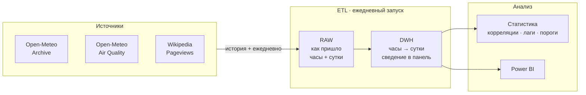

# 🌫️ Air Quality & Weather ETL

Учебный, но настоящий data-проект: ежедневный сбор данных о качестве воздуха
и погоде в одном городе, хранение в базе и анализ связи между ними.


---

## О проекте

Вопрос, на который отвечает проект: **что делает воздух в городе грязным —
выбросы или погода?**

Выбросы в будний день примерно постоянны, а концентрация загрязнителей
меняется в разы. Значит дело в атмосфере: ветер разгоняет, штиль и мороз
запирают, дождь вымывает. Проект измеряет этот эффект количественно.

Третий источник добавляет человеческое измерение: **замечают ли люди грязный
воздух** и через сколько дней после эпизода начинают о нём читать.

Проект небольшой намеренно — три источника, один город. Цель: пройти весь
цикл целиком (сбор → хранение → трансформация → анализ → визуализация),
а не утонуть в парсинге на первом же шаге.

---

## Источники данных

Все три — без ключей, без регистрации, с доступной историей.

| Источник | Что даёт | Шаг | Глубина |
|----------|----------|-----|---------|
| **Open-Meteo Archive** | температура, ветер, осадки, давление | сутки | с 1940 |
| **Open-Meteo Air Quality** | PM2.5, PM10, NO₂, озон, EAQI | час → сводим к суткам | с 2013 |
| **Wikipedia Pageviews** | просмотры «Смог», «Загрязнение воздуха» | сутки | с 2015 |

### Что проверено на практике

- У API качества воздуха **нет параметра `daily`** — данные отдаются только
  по часам. Суточные агрегаты (среднее, максимум, минимум) считаются на нашей
  стороне. Это первая и главная трансформация проекта.
- Границы истории воздуха API сообщает явно: `allowed range from 2013-01-01`.
  Запрос за пределами диапазона возвращает `{"error": true, "reason": ...}` —
  на это можно опираться в коде.
- Параметр `timezone` определяет, где проходит граница суток. Без него сутки
  считаются по Гринвичу, и суточный цикл загрязнения смещается на часы пояса.
- Объём: 24 значения в сутки против одного у погоды. Год — около 8 760 строк
  на переменную. Историю выкачиваем по годам, а не одним запросом.

---

## Гипотезы

| # | Гипотеза | Почему интересно |
|---|----------|------------------|
| 1 | Ветер разгоняет PM2.5 — связь обратная и сильная | базовая проверка, что данные вообще осмысленны |
| 2 | Штиль плюс мороз даёт накопление | зимняя температурная инверсия запирает воздух у земли |
| 3 | Дождь вымывает частицы, причём PM10 сильнее, чем PM2.5 | крупные частицы вымываются легче — эффект должен различаться |
| 4 | У PM2.5 два суточных пика — утренний и вечерний | видно только на часовых данных; след автомобильных пробок |
| 5 | Озон ведёт себя **наоборот**: растёт в жару и на солнце | он не выбрасывается, а образуется фотохимически из выхлопа |
| 6 | Внимание людей отстаёт от эпизода загрязнения на 1–2 дня | та же логика «событие против реакции», что и в новостной аналитике |

Гипотеза 5 — самая ценная методически: один и тот же фактор (температура)
действует на два вещества в противоположные стороны. Это защищает от
поверхностного вывода «жара = грязный воздух».

---

## Архитектура



**Историю берём сразу, дальше растим ежедневно.** Все три источника отдают
прошлое, поэтому анализ можно делать с первого дня, не дожидаясь накопления
данных. Ежедневный запуск просто продолжает ряд.

**Идемпотентность.** Ежедневный DAG будет запускаться повторно и на пересечении
дат. Загрузка через `INSERT ... ON CONFLICT DO UPDATE` по ключу
`(город, дата, показатель)`, а не `TRUNCATE + INSERT`.

**Задержка данных.** Архивный API отдаёт погоду с лагом в несколько дней,
поэтому ежедневный сбор идёт через forecast-эндпоинт с параметром `past_days`,
а архив используется для разовой заливки истории.

---

## Стек

| Слой | Инструменты |
|------|-------------|
| Язык | Python 3.11 |
| Запросы | requests |
| Обработка | pandas |
| Хранилище | PostgreSQL |
| Оркестрация | планировщик задач → Apache Airflow (Docker) |
| Статистика | statsmodels, scipy |
| Визуализация | matplotlib, Power BI |

Оркестрация усложняется поэтапно намеренно: сначала обычный скрипт по
расписанию, потом Airflow. Так видно, какую именно задачу решает Airflow,
а не принимается на веру.

---

## Структура репозитория

```
.
├── exploration/       # ноутбуки-черновики, разведка API
│   └── open_meteo.ipynb
├── etl/
│   ├── extract/       # клиенты трёх API
│   ├── transform/     # часы → сутки, сведение в панель
│   └── load/          # загрузка в PostgreSQL
├── sql/               # DDL слоёв raw / dwh
├── dags/              # Airflow DAG'и (появятся на этапе 7)
├── analysis/          # проверка гипотез, графики
├── data/              # локальные CSV на раннем этапе
└── README.md
```

---

## Статус проекта

Легенда: ✅ готово · 🚧 в работе · 📋 запланировано

| # | Этап | Статус |
|---|------|--------|
| 1 | Разбор API: Open-Meteo Archive | ✅ |
| 2 | Разбор API: Open-Meteo Air Quality | 🚧 |
| 3 | Разбор API: Wikipedia Pageviews | 📋 |
| 4 | Скачивание истории в CSV | 📋 |
| 5 | Трансформация: часы → суточные агрегаты | 📋 |
| 6 | Сведение трёх источников в одну таблицу | 📋 |
| 7 | Ежедневный сбор по расписанию | 📋 |
| 8 | PostgreSQL: схема и загрузка | 📋 |
| 9 | Airflow в Docker | 📋 |
| 10 | Описательная статистика и графики | 📋 |
| 11 | Проверка гипотез, доверительные интервалы | 📋 |
| 12 | Power BI дашборд | 📋 |

---

## Запуск

```bash
pip install requests pandas

# разведочный запрос (пример)
python etl/extract/air_quality.py
```

Раздел будет дополняться по мере готовности.

---

## Ограничения

- Данные наблюдательные: рандомизации нет, поэтому корректная формулировка —
  «связь», а не «причина». Там, где физический механизм известен (ветер
  рассеивает частицы), об этом говорится отдельно.
- Значения по координате — это модельный реанализ, а не показания станции
  у твоего дома. Локальные источники (стройка, магистраль) в них не видны.
- Метеорологические ряды автокоррелированы: соседние дни похожи, поэтому
  наивные тесты завышают значимость. Нужны поправки или перестановочные тесты.
- Просмотры Википедии — грубый прокси внимания. Всплеск может быть вызван
  посторонней новостью, а не качеством воздуха.
