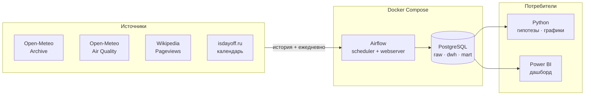

# 🌫️ Air Quality & Weather ETL

Учебный, но настоящий data-проект: ежедневный сбор данных о качестве воздуха
и погоде в одном городе, хранение в PostgreSQL и анализ связи между ними.
Вся инфраструктура поднимается в Docker, витрины считаются на SQL,
результат выводится в Power BI.


---

## О проекте

Вопрос, на который отвечает проект: **что делает воздух в городе грязным —
выбросы или погода?**

Выбросы в будний день примерно постоянны, а концентрация загрязнителей
меняется в разы. Значит дело в атмосфере: ветер разгоняет, штиль и мороз
запирают, дождь вымывает. Проект измеряет этот эффект количественно.

Производственный календарь добавляет то, чего обычно не хватает наблюдательным
исследованиям, — **квазиэксперимент**. Новогодние каникулы дают десять дней
резкого падения трафика, никак не связанного с погодой. Сравнение рабочего
и праздничного дня при одинаковой температуре и ветре позволяет отделить
вклад транспорта от вклада атмосферы.

Проект небольшой намеренно — четыре источника, один город. Цель: пройти весь
цикл целиком (сбор → хранение → трансформация → анализ → дашборд),
а не утонуть в парсинге на первом же шаге.

---

## Источники данных

Все четыре — без ключей, без регистрации, с доступной историей.

| Источник | Что даёт | Шаг | Глубина | Формат |
|----------|----------|-----|---------|--------|
| **Open-Meteo Archive** | температура, ветер, осадки, давление | сутки | с 1940 | JSON |
| **Open-Meteo Air Quality** | PM2.5, PM10, NO₂, озон, EAQI | час → сводим к суткам | с 2013 | JSON |
| **Wikipedia Pageviews** | просмотры «Смог», «Загрязнение воздуха» | сутки | с 2015 | JSON |
| **isdayoff.ru** | производственный календарь РФ | сутки | с 2013 | простой текст |

### Что проверено на практике

- У API качества воздуха **нет параметра `daily`** — данные отдаются только
  по часам. Суточные агрегаты считаются на нашей стороне. Это первая
  и главная трансформация проекта.
- Границы истории воздуха API сообщает явно: `allowed range from 2013-01-01`.
  Запрос за пределами диапазона возвращает `{"error": true, "reason": ...}`.
- Параметр `timezone` определяет, где проходит граница суток. Без него сутки
  считаются по Гринвичу, и суточный цикл загрязнения смещается на часы пояса.
- `isdayoff.ru` отдаёт **не JSON**, а строку вида `1111111100001100...`,
  где позиция символа равна номеру дня в месяце. Вызывать `.json()` нельзя.
- OpenAQ (реальные наземные станции) сейчас требует API-ключ: v3 отвечает
  `Unauthorized`, v2 закрыта с кодом `410`. Оставлено на будущее как способ
  сверить модельные данные с измерениями.
- Объём: 24 значения в сутки против одного у погоды. Год — около 8 760 строк
  на переменную. Историю выкачиваем по годам, а не одним запросом.

---

## Гипотезы

| # | Гипотеза | Почему интересно |
|---|----------|------------------|
| 1 | Ветер разгоняет PM2.5 — связь обратная и сильная | базовая проверка, что данные осмысленны |
| 2 | Штиль плюс мороз даёт накопление | зимняя температурная инверсия запирает воздух у земли |
| 3 | Дождь вымывает частицы, PM10 сильнее, чем PM2.5 | крупные частицы вымываются легче — эффект должен различаться |
| 4 | У PM2.5 два суточных пика — утренний и вечерний | видно только на часовых данных; след автомобильных пробок |
| 5 | Озон ведёт себя **наоборот**: растёт в жару и на солнце | образуется фотохимически, а не выбрасывается |
| 6 | В праздники PM2.5 ниже при той же погоде | квазиэксперимент: вклад транспорта |
| 7 | В выходные суточные пики сглаживаются | подтверждение, что пики — это пробки |
| 8 | Внимание людей отстаёт от эпизода на 1–2 дня | логика «событие против реакции» |

Гипотеза 5 — самая ценная методически: один и тот же фактор (температура)
действует на два вещества в противоположные стороны. Это защищает от
поверхностного вывода «жара = грязный воздух».

---

## Архитектура



**Историю берём сразу, дальше растим ежедневно.** Все источники отдают прошлое,
поэтому анализ можно делать с первого дня, не дожидаясь накопления данных.
Ежедневный запуск просто продолжает ряд.

**Идемпотентность.** Ежедневный DAG будет запускаться повторно и на пересечении
дат. Загрузка через `INSERT ... ON CONFLICT DO UPDATE` по естественному ключу,
а не `TRUNCATE + INSERT`.

**Задержка данных.** Архивный API отдаёт погоду с лагом в несколько дней,
поэтому ежедневный сбор идёт через forecast-эндпоинт с параметром `past_days`,
а архив используется для разовой заливки истории.

---

## Docker

Вся инфраструктура живёт в контейнерах — на машине не появляется ни Postgres,
ни Airflow, ни их зависимостей. Поднимается и сносится одной командой.

```bash
cd docker
cp .env.example .env        # логины, пароли, город, координаты
docker compose up -d
docker compose ps           # проверить, что всё поднялось
```

### Сервисы

| Сервис | Образ | Порт | Назначение |
|--------|-------|------|------------|
| `postgres` | `postgres:16` | `5432` | хранилище данных проекта |
| `airflow-init` | `apache/airflow:2.9` | — | разовая инициализация БД метаданных и админа |
| `airflow-scheduler` | `apache/airflow:2.9` | — | запускает DAG'и по расписанию |
| `airflow-webserver` | `apache/airflow:2.9` | `8080` | веб-интерфейс Airflow |

После запуска: Airflow UI — `http://localhost:8080`, PostgreSQL — `localhost:5432`.

### Тома

| Том / монтирование | Зачем |
|---|---|
| `pgdata:/var/lib/postgresql/data` | данные переживают пересоздание контейнера |
| `./dags:/opt/airflow/dags` | DAG'и правятся на хосте, подхватываются на лету |
| `./sql:/opt/airflow/sql` | DDL и скрипты витрин доступны из тасков |
| `./logs:/opt/airflow/logs` | логи запусков видны с хоста |

### Важные детали

- **Две разные базы.** Airflow держит свои метаданные отдельно от данных
  проекта. Либо два контейнера Postgres, либо две базы в одном — но смешивать
  в одной схеме нельзя: снесёшь метаданные вместе с данными.
- **Пароли не в репозитории.** Все секреты в `.env`, который добавлен
  в `.gitignore`. В репозитории лежит только `.env.example` с пустыми полями.
- **Подключение из Python внутри контейнера** идёт по имени сервиса
  (`host=postgres`), а не по `localhost`. Из Power BI на хосте — наоборот,
  по `localhost:5432`. Это частый источник путаницы.
- **Память.** Airflow с планировщиком и вебсервером просит около 4 ГБ.
  На слабой машине можно поднять только Postgres, а скрипты запускать руками —
  проект от этого не сломается.

---

## SQL и схема данных

Три слоя, каждый со своей ответственностью.

```
raw   →  как пришло из API, без обработки
dwh   →  типизировано, часы свёрнуты в сутки, источники сведены
mart  →  готовые витрины под дашборд
```

Смысл разделения: если завтра поменяется логика агрегации или список
отслеживаемых статей Википедии, пересчитывается `dwh`, а `raw` не трогается —
данные не надо выкачивать заново.

### Слой raw

| Таблица | Ключ | Содержание |
|---------|------|------------|
| `raw.weather_daily` | `(city, date)` | температура, ветер, осадки, давление |
| `raw.air_quality_hourly` | `(city, ts)` | PM2.5, PM10, NO₂, O₃, EAQI по часам |
| `raw.wiki_pageviews` | `(project, article, date)` | просмотры статей |
| `raw.calendar_ru` | `(date)` | выходной, предпраздничный |

В каждой таблице служебные поля `loaded_at` и `source_url` — чтобы всегда
можно было понять, когда и откуда взялась строка.

```sql
CREATE TABLE raw.air_quality_hourly (
    city        text        NOT NULL,
    ts          timestamptz NOT NULL,
    pm2_5       numeric,
    pm10        numeric,
    no2         numeric,
    o3          numeric,
    european_aqi numeric,
    loaded_at   timestamptz NOT NULL DEFAULT now(),
    PRIMARY KEY (city, ts)
);
```

Первичный ключ по `(city, ts)` — это и есть то, что делает загрузку
идемпотентной:

```sql
INSERT INTO raw.air_quality_hourly (city, ts, pm2_5, pm10)
VALUES (%s, %s, %s, %s)
ON CONFLICT (city, ts) DO UPDATE
SET pm2_5 = EXCLUDED.pm2_5,
    pm10  = EXCLUDED.pm10,
    loaded_at = now();
```

Запусти DAG хоть десять раз подряд — дублей не будет.

### Слой dwh

Главная трансформация: свернуть 24 часа в одну строку на сутки.

```sql
CREATE TABLE dwh.air_quality_daily AS
SELECT
    city,
    (ts AT TIME ZONE 'Europe/Moscow')::date       AS date,
    avg(pm2_5)                                    AS pm25_avg,
    max(pm2_5)                                    AS pm25_max,
    min(pm2_5)                                    AS pm25_min,
    count(*) FILTER (WHERE pm2_5 IS NOT NULL)     AS hours_with_data
FROM raw.air_quality_hourly
GROUP BY city, (ts AT TIME ZONE 'Europe/Moscow')::date;
```

Поле `hours_with_data` не декоративное: если в сутках оказалось 5 часов вместо
24, среднее по ним сравнивать с полными сутками нельзя. Такие дни либо
отбрасываются, либо помечаются в анализе.

Дальше всё сводится в одну панель — по строке на сутки:

| `dwh.fact_daily` | |
|---|---|
| ключ | `(city, date)` |
| воздух | `pm25_avg`, `pm25_max`, `pm10_avg`, `no2_avg`, `o3_avg`, `eaqi_max` |
| погода | `tmax`, `tmin`, `tavg`, `wind_max`, `precip`, `pressure` |
| календарь | `is_dayoff`, `is_preholiday`, `day_of_week`, `is_newyear_holidays` |
| внимание | `wiki_views_smog`, `wiki_views_pollution` |
| производные | `pm25_lag1`, `wind_lag1`, `pm25_ma7`, `season` |

Именно эту таблицу читают и Python-анализ, и Power BI.

### Слой mart

Небольшие витрины под конкретные вопросы: суточный цикл по часам, сравнение
рабочих и праздничных дней, помесячная сводка. Считаются вьюхами или
материализованными вьюхами — данных мало, тяжёлых расчётов нет.

---

## Power BI

Дашборд подключается **напрямую к PostgreSQL**, без выгрузки в файлы.

### Подключение

`Получить данные` → `База данных PostgreSQL` → сервер `localhost:5432`,
база `airquality`. Для первого подключения Power BI попросит установить
провайдер **Npgsql** — без него коннектора к Postgres в списке не будет.

Режим — `Import`, а не `DirectQuery`: данных мало, а импорт даёт быстрые
пересчёты и работает без запущенного контейнера.

Забирать надо готовую `dwh.fact_daily` и витрины из `mart`, а не сырые
почасовые таблицы. Агрегация — задача SQL, не Power BI.

### Страницы дашборда

| Страница | Что показывает |
|----------|----------------|
| **Обзор** | PM2.5 во времени, текущий EAQI, число дней выше нормы ВОЗ |
| **Погода и воздух** | точечные диаграммы «ветер → PM2.5», «температура → озон» |
| **Суточный цикл** | средний профиль по часам, рабочие дни против выходных |
| **Праздники** | сравнение при сопоставимой погоде — вклад транспорта |
| **Сезонность** | помесячные и понедельные срезы, зима против лета |
| **Внимание** | просмотры Википедии поверх эпизодов загрязнения |

Страница «Праздники» — ключевая: на ней виден результат квазиэксперимента,
а не просто корреляция.

---

## Стек

| Слой | Инструменты |
|------|-------------|
| Язык | Python 3.11 |
| Запросы | requests |
| Обработка | pandas |
| Хранилище | PostgreSQL 16 |
| Оркестрация | планировщик задач → Apache Airflow 2.9 |
| Инфраструктура | Docker, Docker Compose |
| Статистика | statsmodels, scipy |
| Визуализация | matplotlib, Power BI |

Сложность наращивается поэтапно намеренно: сначала обычный скрипт и CSV,
потом PostgreSQL, потом Airflow в Docker. Так видно, какую именно задачу
решает каждый инструмент, а не принимается на веру.

---

## Структура репозитория

```
.
├── exploration/       # ноутбуки-черновики, разведка API
│   └── open_meteo.ipynb
├── etl/
│   ├── extract/       # клиенты четырёх источников
│   ├── transform/     # часы → сутки, сведение в панель
│   └── load/          # загрузка в PostgreSQL
├── sql/
│   ├── ddl/           # создание схем и таблиц raw / dwh / mart
│   └── marts/         # витрины под дашборд
├── dags/              # Airflow DAG'и
├── docker/
│   ├── docker-compose.yml
│   ├── .env.example   # шаблон переменных, без секретов
│   └── Dockerfile     # образ Airflow с нужными пакетами
├── analysis/          # проверка гипотез, графики
├── powerbi/           # .pbix файл дашборда
├── data/              # локальные CSV на раннем этапе
└── README.md
```

---

## Статус проекта

Легенда: ✅ готово · 🚧 в работе · 📋 запланировано

| # | Этап | Статус |
|---|------|--------|
| 1 | Разбор API: Open-Meteo Archive | ✅ |
| 2 | Разбор API: Open-Meteo Air Quality | 🚧 |
| 3 | Разбор API: Wikipedia Pageviews | 📋 |
| 4 | Разбор API: производственный календарь | 📋 |
| 5 | Скачивание истории в CSV | 📋 |
| 6 | Трансформация: часы → суточные агрегаты | 📋 |
| 7 | Сведение источников в одну таблицу | 📋 |
| 8 | Docker: PostgreSQL | 📋 |
| 9 | SQL: схемы raw / dwh, DDL, идемпотентная загрузка | 📋 |
| 10 | Ежедневный сбор по расписанию | 📋 |
| 11 | Docker: Airflow, перенос сбора в DAG'и | 📋 |
| 12 | SQL: витрины mart | 📋 |
| 13 | Описательная статистика и графики | 📋 |
| 14 | Проверка гипотез, доверительные интервалы | 📋 |
| 15 | Power BI дашборд | 📋 |

---

## Запуск

```bash
# 1. Зависимости для скриптов
pip install requests pandas psycopg2-binary

# 2. Инфраструктура
cd docker
cp .env.example .env
docker compose up -d

# 3. Создание схем и таблиц
docker compose exec -T postgres psql -U airquality -d airquality < ../sql/ddl/init.sql

# 4. Разовая заливка истории
python etl/extract/air_quality.py --from 2013-01-01 --to 2026-08-01

# Airflow UI: http://localhost:8080
```

Раздел будет дополняться по мере готовности этапов.

---

## Ограничения

- Данные наблюдательные: рандомизации нет, поэтому корректная формулировка —
  «связь», а не «причина». Исключение — сравнение праздников и рабочих дней,
  где источник вариации внешний по отношению к погоде.
- Значения по координате — это модельный реанализ, а не показания станции
  у твоего дома. Локальные источники (стройка, магистраль) в них не видны.
  Проверка по наземным станциям возможна через OpenAQ, но требует API-ключа.
- Метеорологические ряды автокоррелированы: соседние дни похожи, поэтому
  наивные тесты завышают значимость. Нужны поправки или перестановочные тесты.
- Просмотры Википедии — грубый прокси внимания. Всплеск может быть вызван
  посторонней новостью, а не качеством воздуха.
- Праздники в России приходятся на январь и май, то есть на конкретные сезоны.
  Сравнивать их можно только с днями сопоставимой погоды, иначе сезонность
  будет принята за эффект транспорта.
