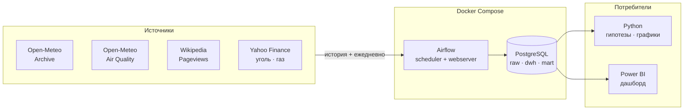

# 🌫️ Air Quality ETL & Analytics

> **Проект в разработке.** Этот файл — план и дорожная карта. Сейчас идёт
> этап разведки источников. Актуальное состояние — в разделе
> [Статус проекта](#статус-проекта).


---

## О проекте

Главный город исследования — **Краков**. Зимой он регулярно входит в список
самых грязных городов мира: котловина, печное отопление, температурная
инверсия.

Вопрос проекта: **чем объясняется зимний смог — погодой, поведением людей
или ценой топлива?**

Погода определяет, рассеется загрязнение или запрётся у земли. Цена угля
определяет, чем люди топят. Просмотры Википедии показывают, замечают ли
жители проблему. Четыре источника дают четыре независимых угла на одно
явление.

---

## Источники данных

Все четыре — без ключей и без регистрации.

| Источник | Что даёт | Шаг | Глубина |
|----------|----------|-----|---------|
| Open-Meteo Archive | температура, ветер, осадки, давление | сутки | с 1940 |
| Open-Meteo Air Quality | PM2.5, PM10, NO₂, SO₂, озон, EAQI | час | с 2013 (Европа) |
| Wikipedia Pageviews | просмотры статей о смоге | сутки | с 07.2015 |
| Yahoo Finance | цена угля `MTF=F`, газа `TTF=F` | день | с 2013 / с 10.2017 |

---

## Что уже выяснено на разведке

**У API качества воздуха нет параметра `daily`** — только почасовые значения.
Суточные агрегаты придётся считать самому.

**Покрытие ограничено Европой.** Реанализ CAMS работает с 2013 года; восточнее
Урала — глобальная модель с архивом примерно с августа 2022. Проверял на Уфе:
данные начинаются 04.08.2022.

**Тихая ловушка:** при запросе за пределами покрытия API отвечает `HTTP 200`
и отдаёт массив из одних `null`, без ошибки. Проверка на пустые значения
нужна везде.

**Объём удобный.** 13.5 лет почасовых данных по одному городу — 119 064
значения, отдаётся одним запросом. Пропусков в краковском ряду всего два.

**Максимум за историю Кракова** — 271 мкг/м³ PM2.5, 20 января 2025, 22:00.
Топ-10 худших часов за 13 лет: все десять в январе, все между 20:00 и 01:00.
Вечерняя растопка печей в мороз видна простой сортировкой.

**Пики подтверждаются новостями.** 20.01.2025 — второй уровень угрозы
загрязнением. 19–20.01.2026 — третий, максимальный: PM10 225, PM2.5 161,
оповещения населения, бесплатный транспорт, третье место в рейтинге IQAir.

**Цены стыкуются по датам.** `MTF=F` — 4 121 торговый день начиная
с 04.01.2013, ровно с начала данных о воздухе. Диапазон 38.6–438.4.
Время у Yahoo приходит в Unix-формате.

---

## Города и дизайн исследования

Цена угля — **одна общая серия для всех городов**. Значит города образуют
панель, и проверять можно не просто «связь есть», а **где именно она есть**.

Отношение зима/лето по PM2.5 показывает долю загрязнения, связанную
с отоплением (расчёт по 2024 году):

| Город | Зима | Лето | Зима/лето | Топливо | Роль |
|-------|-----:|-----:|----------:|---------|------|
| Краков | 37.2 | 11.4 | 3.26 | уголь | обработка |
| Катовице | 35.3 | 12.2 | 2.90 | уголь | обработка |
| Сараево | 31.9 | 10.2 | 3.12 | уголь | обработка |
| Милан | 55.3 | 10.9 | 5.06 | дрова | промежуточная |
| Париж | 14.3 | 8.5 | 1.68 | газ | контроль |
| Москва | 28.6 | 20.9 | 1.37 | ТЭЦ | контроль |

Если цена угля действительно влияет на воздух, эффект должен быть сильным
в Кракове и Катовице, слабее в Милане и **нулевым в Париже и Москве**.
Контрольные города работают как плацебо-тест: если «влияние» найдётся и там,
значит модель поймала общий тренд, а не механизм.

---

## Гипотезы

| # | Гипотеза | Метод проверки |
|---|----------|----------------|
| 1 | Ветер разгоняет PM2.5, связь обратная и сильная | корреляция, регрессия |
| 2 | Мороз плюс штиль дают накопление (инверсия) | взаимодействие факторов |
| 3 | Дождь вымывает частицы, PM10 сильнее, чем PM2.5 | сравнение коэффициентов |
| 4 | Зимние пики приходятся на вечер — растопка печей | суточный профиль по часам |
| 5 | Озон растёт в жару и на солнце — обратное поведение | корреляция с температурой |
| 6 | Рост цены угля снижает загрязнение в угольных городах | панельная регрессия с лагом |
| 7 | В газовых городах связи с ценой угля нет | плацебо-тест |
| 8 | Внимание людей отстаёт от эпизода на 1–2 дня | тест Грейнджера, кросс-корреляция |

Гипотезы 4 и 5 уже подтверждаются на глаз, остальные требуют расчётов.

---

## Целевая архитектура



Принципы, заложенные в архитектуру:

**Историю берём сразу, дальше растим ежедневно.** Все источники отдают
прошлое, поэтому анализ можно делать, не дожидаясь накопления данных.
Ежедневный запуск просто продолжает ряд.

**Идемпотентность.** Ежедневный DAG будет запускаться повторно и на
пересечении дат, поэтому загрузка идёт через upsert по естественному ключу,
а не через полную перезапись таблицы.

**Задержка данных.** Архивный API отдаёт погоду с лагом в несколько дней,
поэтому ежедневный сбор пойдёт через forecast-эндпоинт с параметром
`past_days`, а архив используется для разовой заливки истории.

---

## Хранилище: три слоя

```
raw   →  как пришло из API, без обработки
dwh   →  типизировано, часы свёрнуты в сутки, источники сведены
mart  →  готовые витрины под дашборд
```

Смысл разделения: если поменяется логика агрегации или список отслеживаемых
статей, пересчитывается `dwh`, а `raw` не трогается — данные не надо
выкачивать заново.

### Планируемые таблицы

| Слой | Таблица | Ключ | Содержание |
|------|---------|------|------------|
| raw | `air_quality_hourly` | город, час | PM2.5, PM10, NO₂, SO₂, O₃, EAQI |
| raw | `weather_daily` | город, дата | температура, ветер, осадки, давление |
| raw | `wiki_pageviews` | статья, дата | просмотры |
| raw | `fuel_prices` | тикер, дата | котировки угля и газа |
| dwh | `air_quality_daily` | город, дата | суточные агрегаты из часовых |
| dwh | `fact_daily` | город, дата | сводная панель: воздух + погода + цены + внимание |
| mart | витрины | — | суточный профиль, сравнение групп городов, сезонность |

### Решения, принятые заранее

- **Суточные агрегаты**: среднее, максимум, минимум и **число часов
  с данными**. Последнее не декоративное: если в сутках оказалось 5 часов
  вместо 24, среднее по ним нельзя сравнивать с полными сутками.
- **Индекс EAQI сворачивается максимумом**, а не средним: он устроен как
  «оценка по худшему», и его среднее не имеет физического смысла.
- **Признак `city_group`** (`coal` / `wood` / `control`) — то, на чём
  держится плацебо-тест из гипотезы 7.
- **Служебные поля** `loaded_at` и `source_url` в каждой raw-таблице.

---

## Инфраструктура в Docker

Планируется поднять всё в контейнерах, чтобы на машине не появлялось
ни Postgres, ни Airflow с их зависимостями.

| Сервис | Назначение | Порт |
|--------|------------|------|
| `postgres` | хранилище данных проекта | 5432 |
| `airflow-scheduler` | запуск DAG'ов | — |
| `airflow-webserver` | веб-интерфейс | 8080 |

Что важно учесть на этом этапе:

- **Две разные базы.** Airflow хранит метаданные отдельно от данных проекта.
  Смешивать в одной схеме нельзя — снесёшь метаданные вместе с данными.
- **Пароли не в репозитории.** Секреты в `.env`, он в `.gitignore`.
  В репозитории только `.env.example` с пустыми полями.
- **Адрес базы разный.** Изнутри контейнера — по имени сервиса, из Power BI
  на хосте — по `localhost`. Частый источник путаницы.
- **Память.** Airflow просит около 4 ГБ. Если не хватит, можно поднять
  только Postgres, а скрипты запускать вручную — проект не сломается.

---

## Дашборд в Power BI

Подключение напрямую к PostgreSQL, режим `Import`. Забирать готовую панель
`fact_daily` и витрины из `mart`, а не сырые почасовые таблицы: агрегация —
задача SQL, не BI.

Планируемые страницы:

| Страница | Что показывает |
|----------|----------------|
| Обзор | PM2.5 во времени, дни выше нормы ВОЗ, худшие эпизоды |
| Погода и воздух | «ветер → PM2.5», «температура → озон» |
| Суточный цикл | средний профиль по часам, зима против лета |
| Цена угля | котировки поверх загрязнения, угольные города против контрольных |
| Сравнение городов | шесть городов на одной шкале |
| Внимание | просмотры Википедии поверх эпизодов |

Страница «Цена угля» ключевая: на ней виден результат плацебо-теста,
а не просто корреляция.

---

## Стек

| Слой | Инструменты |
|------|-------------|
| Язык | Python 3.11 |
| Запросы | requests |
| Обработка | pandas |
| Хранилище | PostgreSQL |
| Оркестрация | скрипт по расписанию → Apache Airflow |
| Инфраструктура | Docker, Docker Compose |
| Статистика | statsmodels, scipy |
| Визуализация | matplotlib, Power BI |

Инструменты подключаются постепенно намеренно: сначала скрипт и CSV, потом
база, потом оркестрация. Так видно, какую задачу решает каждый из них,
а не принимается на веру.

---

## Целевая структура репозитория

```
.
├── exploration/       # ноутбуки и черновики, разведка API
├── etl/
│   ├── extract/       # клиенты четырёх источников
│   ├── transform/     # часы → сутки, сведение в панель
│   └── load/          # загрузка в PostgreSQL
├── sql/
│   ├── ddl/           # схемы и таблицы raw / dwh / mart
│   └── marts/         # витрины под дашборд
├── dags/              # Airflow DAG'и
├── docker/            # docker-compose, .env.example
├── analysis/          # проверка гипотез, графики
├── powerbi/           # .pbix файл дашборда
├── data/              # локальные CSV на раннем этапе
└── README.md
```

Часть директорий появится по мере прохождения этапов.

---

## Статус проекта

Легенда: ✅ готово · 🚧 в работе · 📋 запланировано

| # | Этап | Статус |
|---|------|--------|
| 1 | Разбор API: Open-Meteo Archive | ✅ |
| 2 | Разбор API: Open-Meteo Air Quality | ✅ |
| 3 | Выбор городов, проверка покрытия данных | ✅ |
| 4 | Разбор API: Wikipedia Pageviews | 🚧 |
| 5 | Разбор API: Yahoo Finance (уголь, газ) | 🚧 |
| 6 | Скачивание истории в CSV | 📋 |
| 7 | Трансформация: часы → суточные агрегаты | 📋 |
| 8 | Сведение источников в панель | 📋 |
| 9 | Описательная статистика и графики | 📋 |
| 10 | Проверка гипотез, плацебо-тест | 📋 |
| 11 | PostgreSQL: схема и загрузка | 📋 |
| 12 | Ежедневный сбор по расписанию | 📋 |
| 13 | Airflow в Docker | 📋 |
| 14 | Витрины mart | 📋 |
| 15 | Power BI дашборд | 📋 |

---

## Ограничения

Честный список того, что проект **не** сможет показать:

- Данные наблюдательные, рандомизации нет — корректная формулировка «связь»,
  а не «причина». Ближе всего к причинному выводу подходит сравнение групп
  городов, где источник вариации внешний.
- Значения по координате — модельный реанализ, а не показания станции.
  Локальные источники не видны, пиковые значения сглажены.
- Мировая цена угля не равна цене мешка угля в котельной: между ними
  логистика, налоги, наценка. Связь заведомо непрямая и слабее, чем с погодой.
- В самом Кракове твёрдое топливо запрещено с 2019 года, топят в пригородах.
  Городская граница не совпадает с границей источника выбросов.
- Метеорологические ряды автокоррелированы: соседние дни похожи, наивные
  тесты завышают значимость.
- Просмотры Википедии — грубый прокси внимания.
- Рейтинг городов посчитан по одному году, на другом порядок может сдвинуться.
